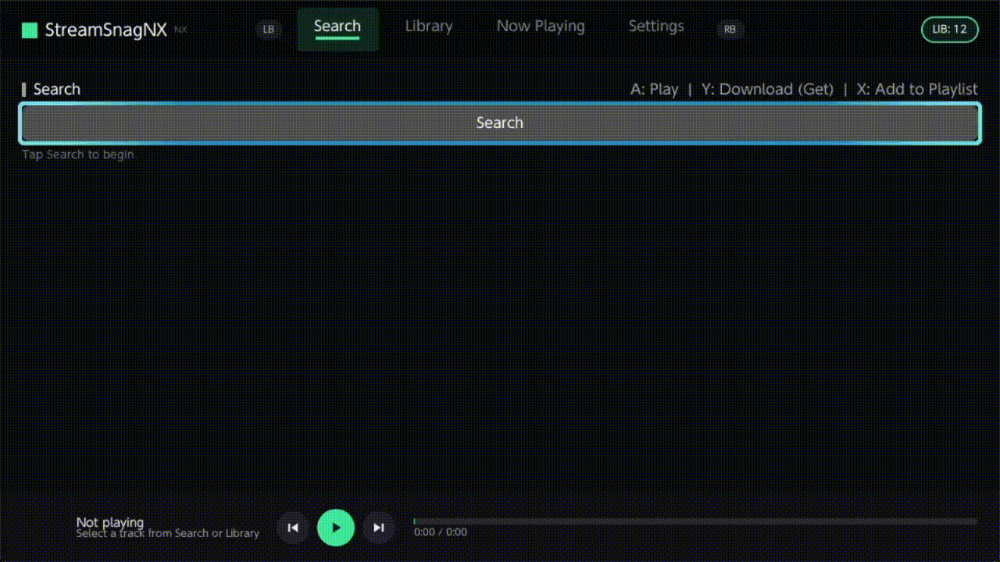
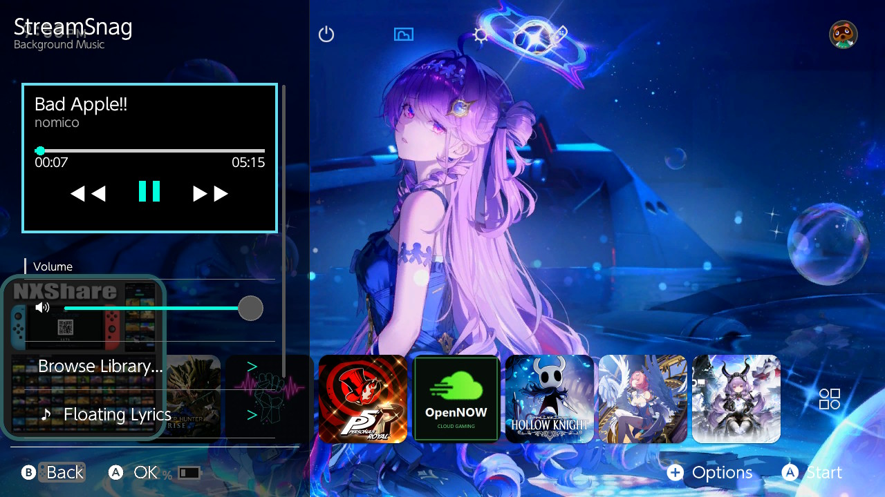

# StreamSnagNX — Your Switch Is a Music Player Now 


*YouTube Music search → offline library → background playback across games
→ floating synced lyrics.*

> Fan-made homebrew for modded Switches (Atmosphere). Trademarks belong to
> their owners — no affiliation with Nintendo, Google/YouTube, or the
> projects below. Separately and plainly: downloading from YouTube Music
> violates YouTube's Terms of Service whether or not you log in, so by
> using the downloader you're opting into that yourself.

## How an evening goes

You play Monster Hunter Rise, then an idea comes to you:

"What if I play Bury the Light while I parry with my longsword? And sing along with floating lyrics?"

But then you have StreamSnagNX.

Yeah. You can do that.


Just download it on StreamSnagNX, open the overlay, play it, open the other overlay for the lyrics, and enjoy.

(And die because I failed to parry.)

## Why I made it

Honestly, I just wanted this for myself.

I couldn't find exactly what I wanted, so I figured: fuck it, I'll make it.

It's AI-assisted — I'm not going to pretend otherwise. AI helped me with parts of the development, but I still had to put the pieces together, debug the thing, test it on actual hardware, and make it work.

Once it started becoming usable, I figured I might as well share it in case someone else wants it too.

## What it can do

- **Search YouTube Music on-console** — no account, no API keys, type and go. (No more dumping from a computer, get it directly on Switch)
- **Download for offline** — audio + synced lyrics land on your SD card,
  tracked in your own library with playlists. Wi-Fi off? Doesn't care.
- **Plays through your games** — a featherweight background daemon with
  hardware decoding. Open a game; the song doesn't flinch.
- **Lyrics that float** — one sleek line at the bottom of your screen
  while you play, gamepad fully yours (yes, dodge works, B is sacred).
- **A library, not a folder** — real song and artist names everywhere,
  caches and half-downloads hidden. When a song ends, the next one just
  starts. (Metadata can still be messy, but it works... YouTube channel/artist matching isn't perfect yet and it uses the youtube title as the title of song)
- **Three remotes, pick your flavor**:
  - the **overlay player** (pretty: live progress, volume, browser),
  - the **lyrics strip** (minimal: just the line),
  - **snag-ctl** (terminal-style: full control, retro feel).

## See it


*Prefer video? [Download the full app-tour demo](docs/media/streamsnagnx-tour.mp4).*




## Get it running (5 minutes)

Copy from `sys-snag/dist/` to your SD, reboot once, done:

| Copy this | Here |
|---|---|
| `dist/atmosphere/contents/4200000000534E47/` (all of it) | `sdmc:/atmosphere/contents/4200000000534E47/` |
| `dist/switch/snag-ctl.nro` | `sdmc:/switch/snag-ctl.nro` |
| `dist/switch/.overlays/StreamSnag.ovl` | `sdmc:/switch/.overlays/StreamSnag.ovl` |
| `dist/switch/.overlays/StreamSnagFloat.ovl` | `sdmc:/switch/.overlays/StreamSnagFloat.ovl` |

First boot sets up `sdmc:/switch/StreamSnagNX/`. Then: download a song in
the app, open the overlay while it plays, and boom... (No, your switch won't explode, it's just me being goofy)

Or, if you don't want to build it yourself, download the latest release and extract it to the root of your SD card.

## Everyday controls

- **Overlay player**: A play/pause · ◀◀ ▶▶ skip · volume slider · Browse
  Library · Floating Lyrics. B backs out, chord jumps between strip
  and player — the strip shows its own hint, you can't get lost.
- **Lyrics strip**: watch. That's it. Game buttons all work underneath.
  Hold **ZL+ZR+Down-pad** to step back to the player.
- **snag-ctl**: Up/Down browse · A play/pause · X force-play ·
  Y reload library · L/R volume · ◀/▶ ∓10 s · Plus exits, music continues.

## Tested on

| | |
|---|---|
| Atmosphere | v1.11.2\|E (`\|E` = emuMMC, `\|S` would be sysCFW — not a typo) |
| Switch firmware | 22.5.0 |
| Model | Switch Lite |
| Menu | Ultrahand 2.5.1 (Tesla Menu should also work — untested) |

Homebrew bites hardest on version combos, so if it works (or doesn't) on
yours, note it down and report it.

## Small print (kept small)

- Opus/WebM audio only for now — `.m4a` files sit out (Tho, you can just set it to download using .opus on the settings, and I'd recommend for stability).
- Only library tracks play; stray files on the SD are ignored on purpose. (This is to avoid playing the cache files)

## Quick fixes (FAQ)

| Symptom | Try |
|---|---|
| Crash/fatal on boot after updating | Wrong/old `exefs.nsp`? Re-copy + full reboot (sleep doesn't reload sysmodules). Check `crash_reports/` for the TitleID. |
| Overlay says Daemon Offline | `boot2.flag` present? Rebooted? `snag-ctl` shows no PID = daemon never started. |
| No sound, but progress moves | Volume at 0? (L/R in `snag-ctl`, slider in overlay.) Wrong file type (`.m4a` doesn't play yet)? |
| Lyrics out of sync | Tune ±0.5 s in the app (Now Playing) — saved per track, overlay follows. |
| Something worked yesterday | Stale file on SD — compare build stamps (`#N`) and the `dist/` dates. |

## License

GPL-2.0 (see `LICENSE`) — Copyright (C) 2026 Wheezee. Same license as the
projects it learns from (sys-tune, Status Monitor, libtesla), so fixes and
forks flow both ways. Contributions welcome: AAC decoding and UI polish
are the current frontiers.

## For builders

```bash
cd sys-snag && make -j4                       # background daemon
cd tools/snag-ctl && make -j4                 # console remote
cd overlay && make -j4 && make -f Makefile.float -j4   # both overlays
cmake -B build -G Ninja && cmake --build build --target StreamSnagNX.nro  # main app
```

Needs devkitPro + devkitA64 + Switch portlibs. Details, architecture notes,
and war stories live in `sys-snag/help-float/` and `AGENTS.md`.

## Thanks

sys-tune (the patterns), Status Monitor (the floating-strip recipe),
Tesla/libtesla, Borealis, libnx + devkitPro, LRCLIB (free lyrics).
Standing on the shoulders of giants.

